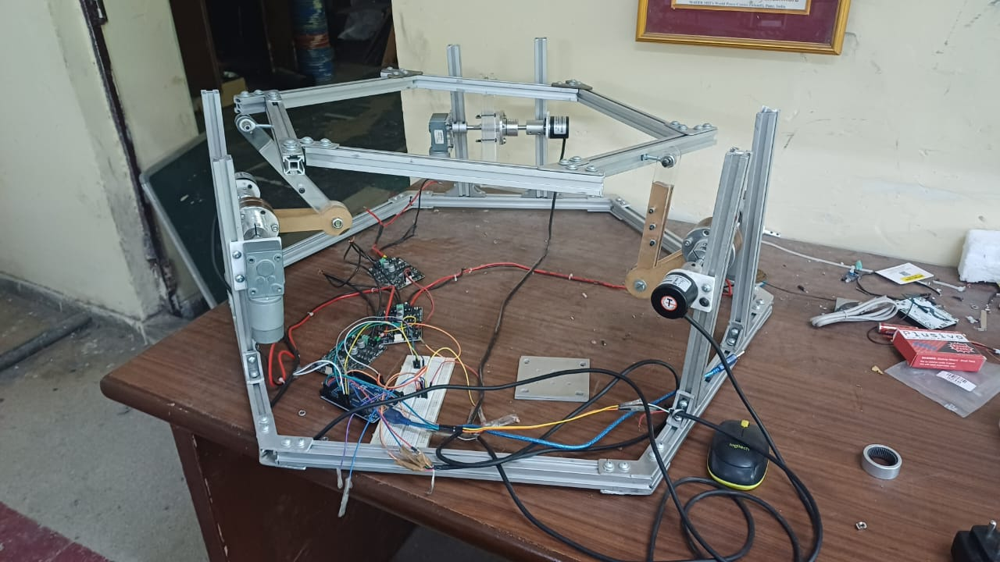

# Robotics Project 2025

  
  
  
  

    
      
  

## 🤖 Project Overview

This repository houses the codebase for the **3RRS Parallel Manipulator**. It serves as a comprehensive collection of resources, including code, CAD models, calculations, and component datasheets. We aim to create a well-documented reference that will enable future teams to build upon our work.

### 🎯 Key Features

- ✅ Robust Mechanism Design
- ✅ Efficient and Fast Inverse Kinematics
- ✅ Precise Orientation with minimal lag

## 🧠 Algorithm Development
The Inverse Kinematics have been completely solved, coded, and used in multiple applications, one being a ball balancing robot. 

## 📚 Resources
- [Intro to Serial and Parallel Manipulators](https://youtu.be/ZZrNe40jpSA?si=esQ4bNgmhpNv93w0)
- [Inverse Kinematics with the example of a Ball Balancing Bot](https://youtu.be/-1pX518wlu8?si=GbBtG65QNJ148i5c)
- [Research Paper on Kinematics and Dynamics of a 3RRS Parallel Manipulator](https://www.researchgate.net/publication/3902626_Inverse_kinematics_and_dynamics_of_the_3-RRS_parallel_platform)

### Software Utilised
- Autodesk Fusion 360
- Python
- Arduino IDE

### Hardware Utilised
- DC Geared Motors
- Rotary Encoders
- Motor Drivers
- Arduino Mega

## 🤝 Contributor Notes
- We follow the [standard Git workflow](https://www.geeksforgeeks.org/git-workflows-with-open-source-collaboration/) for collaboration
- Suggestions for improvement are welcome via **Issues** or Discussions.

---

